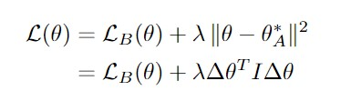
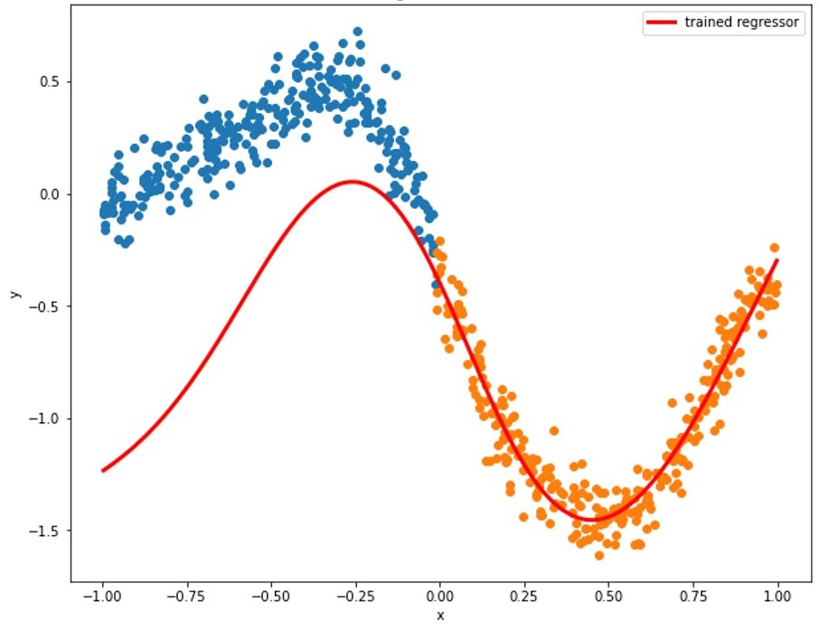
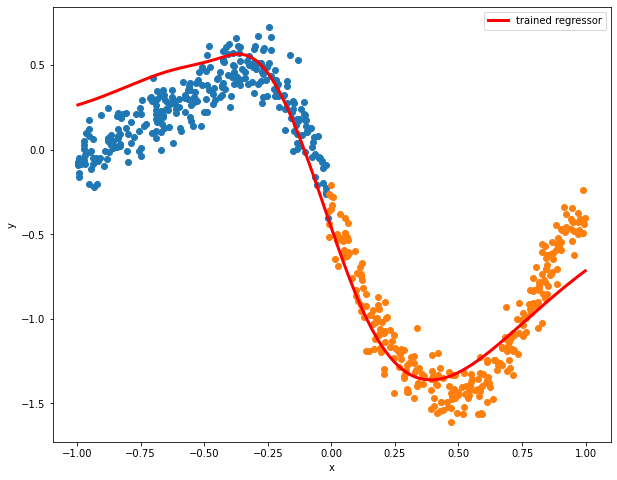
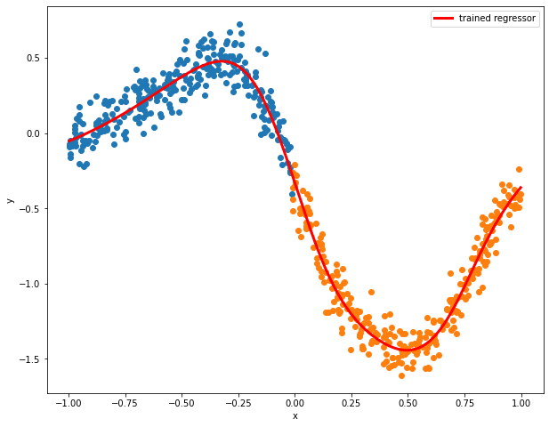
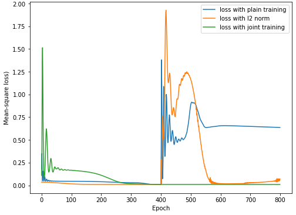

An Entry Point to Regularization-based Methods
============

L2-norm regularization
------------

In short, the rationale of regularization-based methods is to protect what the models learned from previous tasks by including regularization terms in the loss function, so that we can penalize the model change on important weights from old tasks.

Here is a simple example with only two tasks and we will introduce some math fomulas for illustration. Suppose we have data for task A, denoted by DA, and data for task B, denoted by DB. After learning task A, the model obtains the optimal weights and biases for task A, denoted by &theta;A. When learning the second task, task B,  the *L2-norm regularization* adds an **L2-norm** for the difference between the model parameters and the optimal parameters obtained from training on task A to penalize significant model change on weights from the optimal weights for task A. The objective function is below, where LB is the loss function for task B and lambda is the hyper-parameter.

Real Implementation
------------

Let's see some codes then! Here, we experiment with regression on two datasets to test the L2-norm regularization method that we juest mentioned. Using an MLP with two hidden layers (the same as the one used in the first post), the method regresses first on the dataset marked by blue (task A) and then on the one marked by orange (task B). First we can check the raw result - what if we do nothing special and just conduct the training sequentially on the two datasets?

 

Well, clearly we obtain a bad result. Now, we incorporate an L2-norm regularizer on the objective function, and we use this new model to conduc the same training process.

That's pretty cool! It is clear that the L2-norm regularization method can reduce the extent of catastrophic forgetting. It learns the knowledge from the second dataset while remembering some of the information from the first dataset. Why don't we compare it to the result gained from training on the joint dataset? Which one would be better?

Hmmmm... Obviously, the model with L2-norm does not regress better than the regressor trained on the joint datasets. The difference in the performance can be seen from the loss curves.

 The graph above shows training losses on the first dataset during the whole training process. We can see that the loss from training with L2-norm regularization converges close to the loss from training with joint dataset but still somewhat higher in the end. In this case, the L2-norm regularization would be a choice, but may not be the best method for alleviating the catastrophic forgetting.

 That finishes our discussion on the L2-norm regularization method, and we will talk about other more powerful regularization-based methods in the next several posts. Do not miss them if you like this article or are interested in the topic of catastrophic forgetting. Thanks for your support!
